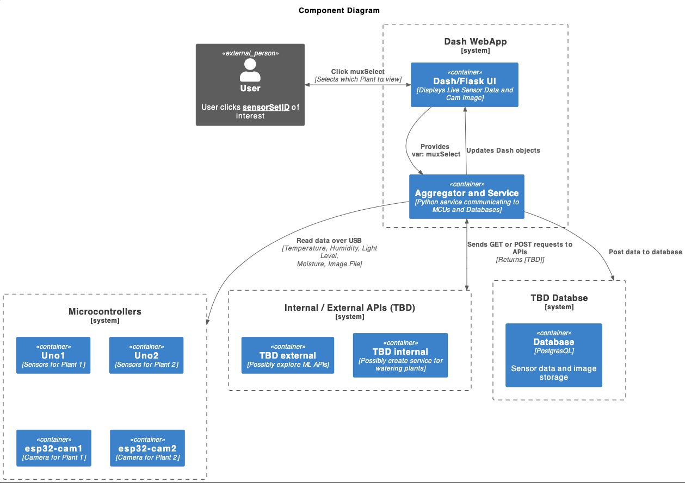
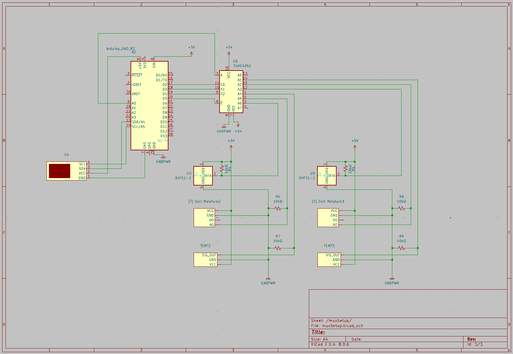
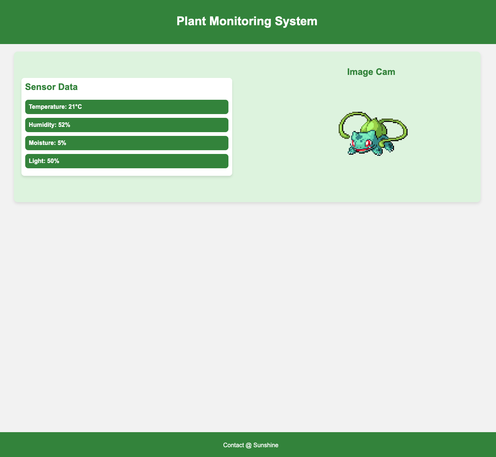

# Plant Monitoring System

This project is still WIP. The goal is to package everything into a set of modular plant monitoring components that can be gifted to plant loving friends.

## About The Project

This project is a HW/SW project.

The HW consists of a set of microcontrollers, sensors, and cameras to monitor the livelihood of house plants. The number of microcontrollers per plant is minimized by multiplexing several sets to sensors to a each sensor microcontroller. This gives flexibility to the number of sensor sets (plants) that can be monitored at the same time.
The SW comprises of a front end dashboard display of dynamic sensor data and imaging of each plant. Data is transmitted from the microcontrollers as serial data over USB. The data and images will also be posted to a database for later correlation analysis.

Future Consideration:
In the future, if scalability becomes a need, then this project can be expanded such that each microcontroller is packaged with one set of sensors. The software can be refactored into a more scalable MQTT pub/sub framework for data brokering between microcontrollers and software services.

### Architecture

Component Diagram:

     
    
     

Electrical Schematic:

     
    
     

Analysis Sequence:
TBD

## Technology Stack

* Hardware
    * Microcontrollers:
        * Arduino Uno R3
            * Sensors: DHT11 temperature/humidity, TEMT6000 light, MH Series conductive moisture
            * Display: LCD1602 I2C
            * MUX: SN74HC4051N (8-channel)
        * ESP32-CAM
            * OV7670 camera
            * ST7789V OLED LCD Display
* Software
    * Front End: Flask/Dash
    * Database: PostgreSQL
    * Deployment: Docker
    * (TBD) Analysis: OpenCV, Scikit-Learn

## File Structure

TBD

### Deployment

TBD

## Example Dashboard

     
    

